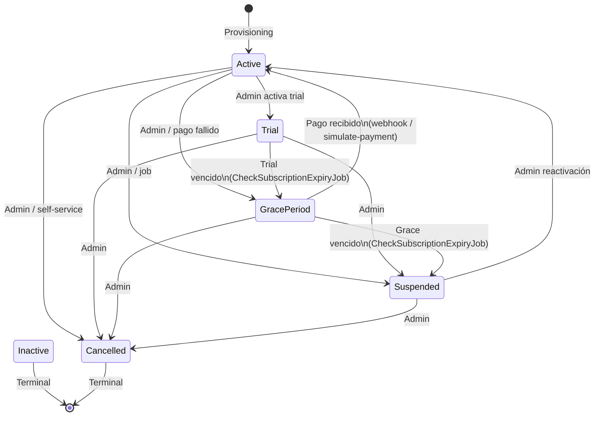
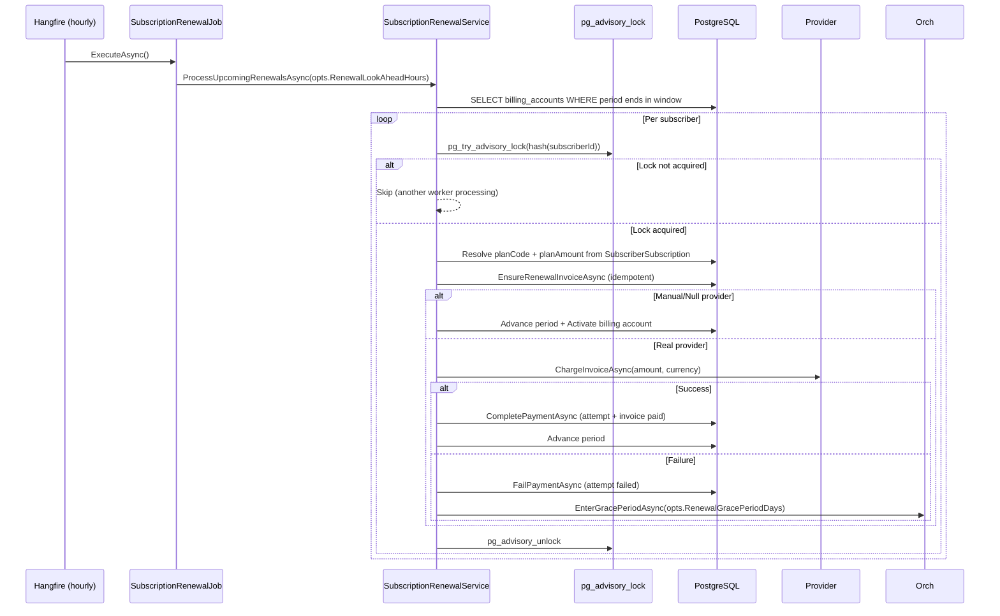
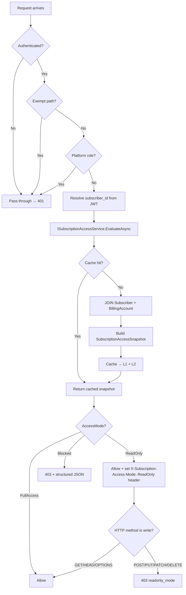
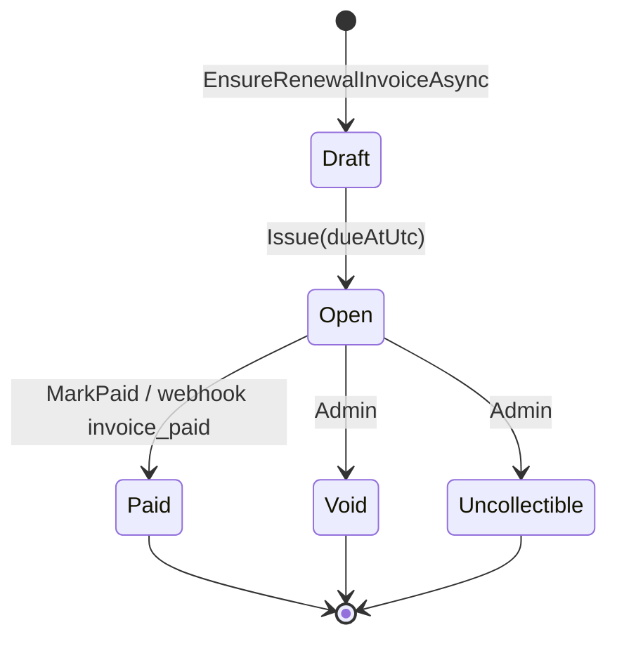
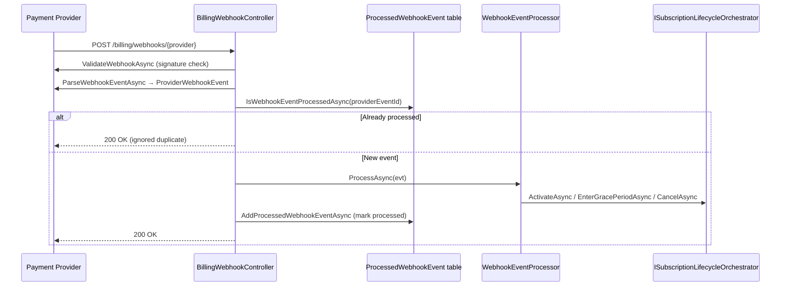
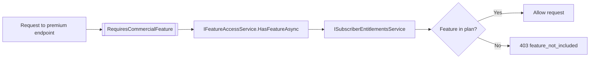

# SaaS Commercial Flow — Architecture Reference

> **Estado:** Production-ready en modo manual/simulado (Stripe/Kushki no conectados)
> **Última actualización:** 2026-05

---

## Sources of Truth

| Aspecto | Entidad | Campo |
|---|---|---|
| Identidad del tenant SaaS | `Subscriber` | `Name`, `Slug`, `PlanCode`, `PreferredLanguage` |
| Lifecycle del tenant | `Subscriber` | `LifecycleStatus` (Active/Trial/GracePeriod/Suspended/Inactive) |
| Estado de facturación | `SubscriberBillingAccount` | `Status` (Trialing/Active/PastDue/GracePeriod/Suspended/Cancelled) |
| Plan activo | `SubscriberSubscription` | `PlanId`, `Status` |
| Módulos habilitados | `SubscriberEntitlementsService` | Resolución dinámica plan + overrides |
| Quotas | `CommercialPlanLimit` | `LimitCode`, `LimitValue` |
| Historial de cobros | `SaasBillingInvoice` | Invoice + Lines |
| Identidad fiscal de facturación | `SubscriberBillingProfile` | RUC, LegalName, Address |
| Identidad fiscal ERP | `Company` | Ruc, LegalName, MainAddress |

---

## 1. Lifecycle de Suscripción



### Reglas de transición
- `Inactive` es terminal — ninguna transición permitida
- `Cancelled` es idempotente — llamar Cancel dos veces es seguro
- `EnterGracePeriodAsync` es idempotente si ya está en GracePeriod con fecha posterior

---

## 2. Renewal Flow



---

## 3. ReadOnly Flow



---

## 4. Invoice Lifecycle



### Reglas de invoice
- `Draft → Open` ocurre inmediatamente en `EnsureRenewalInvoiceAsync`
- `Open → Paid` requiere `CompletePaymentAsync` (que también completa el BillingPaymentAttempt)
- Una invoice `Paid` puede vincular un `ErpInvoiceId` si ZH Technologies emite factura fiscal
- Idempotencia: `EnsureRenewalInvoiceAsync` retorna invoice existente si ya existe para el período

---

## 5. Webhook Flow



---

## 6. Feature Enforcement



### Resolución de entitlements
1. Carga `SubscriberSubscription.PlanId`
2. Carga `CommercialPlanFeature` (plan → feature mapping)
3. Aplica `SubscriptionFeatureOverride` (tenant-level overrides)
4. Override gana sobre plan feature
5. Resultado cacheado en Redis (invalidado cuando cambia el plan)

---

## 7. Cache Architecture

```
Request (subscriber_id)
  │
  ▼
L1: IMemoryCache
  └─ Key: subscription:access:ver:{subscriberId}  → version number
  └─ Key: subscription:access:{subscriberId}:{version} → SubscriptionAccessSnapshot
  └─ TTL: opts.AccessCacheL1TtlSeconds (default: 20s)
  │
  ├─ MISS → L2: IDistributedCache (Redis)
  │           └─ Same keys, TTL: opts.AccessCacheL2TtlMinutes (default: 5m)
  │           └─ MISS → DB rebuild (1 JOIN query, compiled)
  │
  └─ INVALIDATION: increment version key
                   Old snapshot orphaned → expires via TTL
                   No DEL cascade, no Redis storms
```

### Invalidación garantizada en:
- `ActivateAsync`, `SuspendAsync`, `StartTrialAsync`, `EnterGracePeriodAsync`, `CancelAsync`
- `ChangePlatformSubscriberPlanHandler` (entitlements + access)
- `simulate-payment` (via ActivateAsync → orchestrator)

---

## 8. Transaction Boundaries

| Operación | Isolation | Entidades en TX | Seguro en retry |
|---|---|---|---|
| `ActivateAsync` | RepeatableRead | Subscriber + BillingAccount + SubscriberSubscription | ✅ Idempotente |
| `SuspendAsync` | RepeatableRead | Subscriber + BillingAccount + SubscriberSubscription | ✅ Idempotente |
| `EnterGracePeriodAsync` | RepeatableRead | Subscriber + BillingAccount + SubscriberSubscription | ✅ Idempotente |
| `CancelAsync` | RepeatableRead | Subscriber + BillingAccount + SubscriberSubscription | ✅ Idempotente |
| `EnsureRenewalInvoiceAsync` | SaveChanges | SaasBillingInvoice + BillingEvent | ✅ Idempotente |
| `ProcessSubscriberRenewalAsync` | SaveChanges + Advisory Lock | Invoice + Attempt + BillingAccount | ✅ Idempotente |
| `Provisioning` | Serializable | Subscriber + BillingAccount + Company + User | ✅ Atomic rollback |

---

## 9. Configurable Constants (SubscriptionBillingOptions)

Todos los "magic numbers" están centralizados en `SubscriptionBillingOptions`.
Configurar via `appsettings.json` sección `SubscriptionBilling`:

| Opción | Default | Descripción |
|---|---|---|
| `TrialGracePeriodDays` | 7 | Grace period cuando vence el trial |
| `RenewalGracePeriodDays` | 7 | Grace period cuando falla el pago de renovación |
| `WebhookPaymentFailureGracePeriodDays` | 7 | Grace period cuando llega webhook payment_failed |
| `TrialDurationDays` | 14 | Duración del trial para sync de SubscriberSubscription |
| `InvoiceDueDays` | 30 | Días después del período para vencimiento de invoice |
| `RenewalLookAheadHours` | 24 | Horas de anticipación para procesar renovaciones |
| `AccessCacheL1TtlSeconds` | 20 | TTL de L1 memory cache |
| `AccessCacheL2TtlMinutes` | 5 | TTL de L2 Redis cache |
| `AccessCacheVersionTtlDays` | 30 | TTL de la version key en Redis |

---

## 10. Extension Points (Stripe/Kushki futuro)

### Payment Provider
```
IPaymentProvider (interface defined)
  └─ NullPaymentProvider (active, manual billing)
  └─ StripePaymentProvider (NOT implemented — ready for integration)
  └─ KushkiPaymentProvider (NOT implemented — ready for integration)

IPaymentProviderFactory
  └─ PaymentProviderFactory (always returns NullPaymentProvider today)
  └─ Extension: read tenant's provider config from DB → route to correct provider
```

Para agregar Stripe:
1. Implementar `StripePaymentProvider : IPaymentProvider`
2. Registrar en DI
3. Actualizar `PaymentProviderFactory.GetForSubscriber()` para leer config de DB
4. Agregar webhook signature validation en `ValidateWebhookAsync`
5. **NO cambiar ningún otro archivo**

### Notifications
```
IBillingNotificationService (interface defined)
  └─ NullBillingNotificationService (active, only logs)
  └─ Future: SendGridNotificationService, TwilioSmsService
```

### Metered Usage
```
SubscriptionUsage entity (defined, table exists)
  └─ NOT populated yet (no usage incrementers wired)
  └─ Future: increment after company/user/invoice creation
```

---

## 11. Anti-Corruption Boundaries

```
SaaS Layer (ERP.Infrastructure.SaaS)
  │
  ├─ DEPENDS ON:
  │   ├─ ERP.Domain.Billing (entities, interfaces)
  │   ├─ ERP.Domain.Subscribers (entities, interfaces)
  │   ├─ ERP.Domain.Subscriptions (entities, interfaces)
  │   ├─ ERP.Application.Common.Subscriptions (interfaces)
  │   └─ ERP.Infrastructure.Persistence (DbContext)
  │
  └─ DOES NOT DEPEND ON:
      ├─ ERP.Domain.Modules.Sales ❌
      ├─ ERP.Domain.Modules.Fiscal ❌
      ├─ ERP.Domain.Modules.Accounting ❌
      ├─ ERP.Domain.Modules.Payroll ❌
      └─ ERP.Domain.Modules.Inventory ❌
```

El único puente ERP↔SaaS es `SaasBillingInvoice.ErpInvoiceId` que vincula
una factura SaaS con la factura fiscal emitida por ZH Technologies.
Este es un bridge intencional y bien definido.
