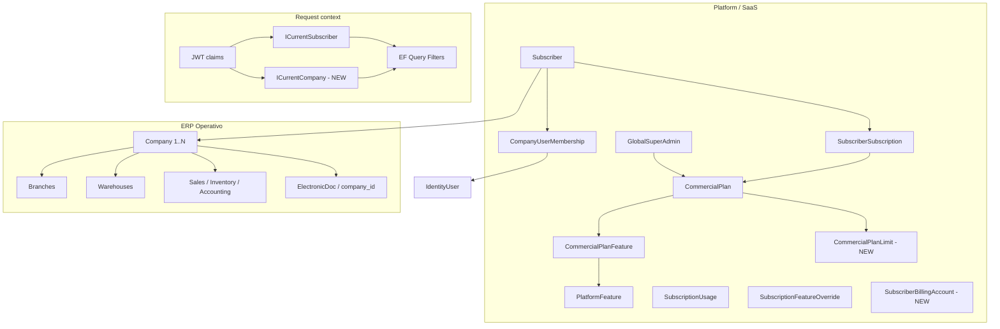

# Enterprise SaaS Foundation Refactor — Impact Analysis

> Basado en auditoría del repositorio `refactor/superadmin-tenant-table-rename-migration` (post Tenant→Subscriber).
> Fecha de referencia: 2026-05-20.

## 1. Impact analysis

### Estado actual (verificado en código)

| Área | Estado | Riesgo |
|------|--------|--------|
| Renombre Tenant→Subscriber | Hecho (~610 archivos backend) | Bajo si migración BD aplicada |
| `Company` fiscal (SRI) | Tabla `company` con `subscriber_id`, **sin uso en Application** | Alto — modelo huérfano |
| Restricción 1:1 | `uq_company_tenant` UNIQUE en `company.subscriber_id` | **Bloqueante** para multiempresa |
| FK `company`→`subscribers` | **No existe** en EF/migraciones | Integridad referencial débil |
| Contexto runtime | Solo `ICurrentSubscriber` | ERP y SaaS comparten un solo eje |
| JWT | `subscriber_id`, sin `company_id` | ERP operativo no puede aislar por empresa |
| `CompanyUserMembership` | `subscriber_id` (no `company_id`) | Nombre engañoso; acceso por suscriptor |
| Entitlements | `CommercialPlanFeature.limit_per_period` mezcla capability + cuota | Governance frágil |
| `commercial_plan_limits` | **No existe** | Límites no normalizados |
| Billing SaaS (Stripe) | **No existe** | Mezcla futura con `billing_settings` ERP |
| Query filter global | `ISubscriberScopedEntity` (~75+ tipos) | Correcto para SaaS; **incorrecto** como eje único ERP |
| Dual key unificado | `sales_document`, `purchase_document` tienen `subscriber_id` + `company_id` | Inconsistencia arquitectónica |

### Impacto por fase

| Fase | Backend | BD | Frontend | Breaking |
|------|---------|-----|----------|----------|
| 1 Multiempresa | Alto | Migración índices/FK | Medio (selector empresa) | Medio — compat 1 company default |
| 2 Contextos | Alto | No | Alto (JWT + stores) | Alto sin feature flag |
| 3 Separar dominios | Muy alto | No | Bajo | Bajo (namespaces) |
| 4 Plan limits | Medio | Nueva tabla | Bajo | Bajo con dual-read |
| 5 Billing | Medio | Nueva tabla | Medio | Bajo inicial |
| 6 Scopes audit | Muy alto | Rename columns futuro | Medio | **Muy alto** — migración masiva |
| 7 Governance | Alto | Redis opcional | Medio | Bajo |
| 8 Seguridad | Alto | RLS preparación | Medio | Bajo |

---

## 2. Dependency map



### Dependencias críticas (orden)

1. `subscribers` (raíz SaaS)
2. `company.subscriber_id` (puente 1:N)
3. `ICurrentSubscriber` + `ICurrentCompany`
4. `company_user_memberships` (+ futuro `company_id`)
5. Handlers que hoy escriben en `Subscriber` como “empresa” (`UpdateSubscriberCompany`)
6. Entitlements (`SubscriberEntitlementsService`)
7. Documentos unificados (`sales_document.company_id`)

---

## 3. Migration strategy

### Principios

- **RenameTable/RenameColumn** para renombres ya hechos (Tenant→Subscriber).
- **Nunca** DropTable en tablas con datos de producción.
- Compatibilidad: **una Company default** por Subscriber existente vía script de backfill.
- Feature flags: `Enterprise:MultiCompany`, `Enterprise:CompanyScopedErp` (appsettings).

### Fase 1 — BD

```sql
-- 1) Eliminar unicidad 1:1
DROP INDEX IF EXISTS uq_company_tenant;
CREATE INDEX ix_company_subscriber_id ON company (subscriber_id);

-- 2) FK integridad
ALTER TABLE company
  ADD CONSTRAINT fk_company_subscribers_subscriber_id
  FOREIGN KEY (subscriber_id) REFERENCES subscribers(id) ON DELETE RESTRICT;

-- 3) Backfill: crear company desde subscriber donde falte (script C# seeder)
```

### Fase 4 — BD

```sql
CREATE TABLE commercial_plan_limits (
  id uuid PRIMARY KEY,
  commercial_plan_id uuid NOT NULL REFERENCES commercial_plans(id),
  limit_code varchar(64) NOT NULL,
  limit_value bigint NOT NULL,
  period_type varchar(16) NOT NULL,
  is_hard_limit boolean NOT NULL DEFAULT true,
  UNIQUE (commercial_plan_id, limit_code)
);
```

### Fase 5 — BD

```sql
CREATE TABLE subscriber_billing_accounts (
  id uuid PRIMARY KEY,
  subscriber_id uuid NOT NULL UNIQUE REFERENCES subscribers(id),
  external_customer_id varchar(128),
  billing_country varchar(3),
  tax_profile_json jsonb,
  ...
);
```

### Fase 6 — ERP scope (futuro, por módulo)

Migración por oleadas: añadir `company_id` NOT NULL donde falte, backfill desde `company` del subscriber, deprecar filtro solo por `subscriber_id` en entidades ERP puras.

---

## 4. Risks

| ID | Riesgo | Prob. | Impacto | Mitigación |
|----|--------|-------|---------|------------|
| R1 | Datos huérfanos `company` sin subscriber válido | Media | Alta | FK + backfill |
| R2 | Handlers siguen actualizando `Subscriber` en lugar de `Company` | Alta | Alta | Adapter + deprecación documentada |
| R3 | Query filter filtra por subscriber donde debe ser company | Alta | Crítica | `ICompanyScopedEntity` + filtro separado |
| R4 | JWT sin `company_id` rompe sesiones | Media | Alta | Claim opcional; default company resolver |
| R5 | Membership sin `company_id` — acceso cross-company | Alta | Crítica | Fase 1b membership |
| R6 | Tests desactualizados (español vs inglés commands) | Alta | Media | No bloquear refactor; track aparte |
| R7 | Migración EF destructiva (DropTable SaaS) | Baja si revisada | Crítica | Solo RenameTable (ya corregido en branch) |
| R8 | SuperAdmin impersonation sin company | Media | Media | Global company null + bypass filters |
| R9 | Dual `subscriber_id` en documentos unificados | Alta | Alta | Fase 6 — fuente de verdad `company_id` |
| R10 | Redis no configurado para entitlements cache | Media | Baja | In-memory fallback dev |

---

## 5. Refactor order (obligatorio)

| Orden | Fase | Entregable |
|-------|------|------------|
| 1 | **Fase 1** | 1:N Company, FK, backfill, quitar `uq_company_tenant` |
| 2 | **Fase 1b** | `CompanyUserMembership.company_id` (opcional subscriber_id) |
| 3 | **Fase 2** | `ICurrentCompany`, JWT `company_id`, switch-company API |
| 4 | **Fase 4** | `CommercialPlanLimit` + enforcement service |
| 5 | **Fase 5** | `SubscriberBillingAccount` (sin Stripe hasta integración) |
| 6 | **Fase 3** | Namespaces `Platform` / `ERP` (mecánico, sin lógica) |
| 7 | **Fase 7** | Entitlements cache + quota counters |
| 8 | **Fase 6** | Re-scope ERP tables → `company_id` (por módulo) |
| 9 | **Fase 8** | Security audit + RLS hooks |

**No iniciar Fase 6 antes de Fase 2** — sin contexto company, re-scoping es peligroso.

---

## 6. EF impacts

| Cambio | Archivos típicos |
|--------|------------------|
| `CompanyConfiguration` | Quitar `uq_company_tenant`, `HasOne<Subscriber>().WithMany()` |
| Nueva migración | `DropIndex`, `CreateIndex`, `AddForeignKey` |
| `ICompanyScopedEntity` | Nuevo interface en `ERP.Domain.Common` |
| `ErpDbContext` | Segundo query filter por `ICurrentCompany` (excluir platform) |
| `CommercialPlanLimit` | Entity + `CommercialPlanLimitConfiguration` |
| `SubscriberBillingAccount` | Entity + config |
| Snapshot | Actualizado por `dotnet ef migrations add` |

Entidades que **permanecen** `ISubscriberScopedEntity`: `Subscriber`, `CompanyUserMembership`, `SubscriberSubscription`, `SubscriptionUsage`, catálogo operativo temporal.

Entidades candidatas a **`ICompanyScopedEntity`** (Fase 6): `Customer`, `Warehouse`, `SalesBill`, `Product`, `JournalEntry`, etc.

---

## 7. Frontend impacts

| Componente | Cambio |
|------------|--------|
| `authStore` | `companyId`, `companies[]` |
| Nueva ruta | `/select-company` post `/select-subscriber` |
| `api.ts` | Header opcional `X-Company-Id` (si no JWT) |
| `syncSessionEntitlements` | Sin cambio (subscriber-scoped) |
| `CompaniesPage` | Renombrar concepto: Subscribers vs Companies |
| `ConfigContext` | `companyId` para parámetros operativos |
| Tipos | `AccessibleCompany`, arreglar `AccessibleTenant` roto |

---

## 8. JWT impacts

| Claim | Bootstrap | Session | Fase |
|-------|-----------|---------|------|
| `subscriber_id` | `Empty` | Activo | Actual |
| `subscriber_ids` | Lista | — | Actual |
| **`company_id`** | — | Activo / Empty | **Fase 2** |
| **`company_ids`** | Lista opcional | — | Fase 2 bootstrap |

`AccessTokenService.GenerateSessionToken` — añadir parámetro `Guid? companyId`.

Login flow: resolver default company (única activa o preferida).

---

## 9. Cache impacts

| Cache key actual | Propuesto |
|------------------|-----------|
| `config:{subscriberId}` | `config:{subscriberId}:{companyId}` (Fase 6) |
| Entitlements | `entitlements:{subscriberId}` — **mantener** (SaaS) |
| Plan limits | `planlimits:{planId}` (Fase 4) |
| Usage counters | `usage:{subscriberId}:{limitCode}:{period}` (Fase 7) |

Invalidación Redis (Fase 7): tag `subscriber:{id}` en cambio plan/overrides.

---

## 10. Authorization impacts

| Control | Scope actual | Target |
|---------|--------------|--------|
| `PermissionHandler` | Subscriber implícito | + validar membership en **company** |
| `GlobalSuperAdmin` | `GLOBAL_SUBSCRIBER_ID` | Sin cambio |
| `RequireFeature` | Subscriber entitlements | Sin cambio |
| Switch subscriber | `/api/auth/switch-subscriber` | Mantener |
| **Switch company** | — | **Nuevo** `/api/auth/switch-company` |
| `IgnoreQueryFilters` | `PlatformQueryReason` | Auditar cross-company |

---

## Fase 6 — Matriz de scopes (auditoría)

### Debe usar `subscriber_id` (SaaS)

- `subscribers`, `subscriber_subscriptions`, `subscription_usages`, `subscription_feature_overrides`, `subscriber_subscription_events`, `subscriber_custom_menus`, `subscriber_billing_accounts` (nuevo)

### Debe usar `company_id` (ERP operativo — target)

- `customers`, `supplier`, `warehouse`, `stock_*`, `sales_bill`, `purchase_order`, `accounts`, `journal_*`, `products`, etc.

### Dual (transición)

- `sales_document`, `purchase_document`, `sales_electronic_doc` — **target:** filtro por `company_id`; `subscriber_id` deprecar

### Correcto hoy con `company_id`

- `company`, `company_user_memberships`, `establishment`, `electronic_doc`, `digital_certificate`, …

---

## Compatibilidad temporal

1. **Default company resolver**: si JWT sin `company_id`, usar única `company` activa del subscriber.
2. **UpdateSubscriberCompany**: delega a `Company` cuando exista fila; si no, crea.
3. **Subscriber profile fields** (`Ruc`, `TradeName`): duplicados hasta migración UI a `Company`.

---

## Checklist de validación post-refactor

- [ ] Un subscriber con 2+ companies en BD
- [ ] Login → JWT con `company_id` (o redirect `/select-company`)
- [ ] Switch company cambia contexto ERP sin cambiar plan SaaS
- [ ] Entitlements siguen por subscriber
- [ ] `MAX_COMPANIES` enforced al crear company
- [ ] SuperAdmin no filtra datos de tenant ajeno
- [ ] Migración `20260520220000_Phase1bCompanyMembershipByCompanyId` aplicada sin pérdida de datos

---

## Fase 1B — Company membership + switch company (implementado)

### Cambios de dominio

- `CompanyUserMembership`: FK `company_id` + `identity_user_id`; **sin** `subscriber_id`.
- Índice único: `(company_id, identity_user_id)`.
- `RefreshToken.CompanyId` opcional para rotación con contexto ERP.

### API

| Método | Ruta | Descripción |
|--------|------|-------------|
| GET | `/api/auth/my-companies` | Empresas accesibles en el suscriptor del JWT |
| POST | `/api/auth/switch-company` | Nuevo JWT + refresh con `company_id` y `company_role` |

### JWT

| Claim | Uso |
|-------|-----|
| `subscriber_id` | SaaS: plan, módulos, billing |
| `company_id` | ERP operativo (opcional hasta selección) |
| `company_role` | Rol en la empresa activa |

### Frontend

- Ruta `/select-company` + `authService.listMyCompanies` / `switchCompany`.
- `ProtectedRoute`: redirige si hay `subscriberId` pero falta `companyId`.
- Login / bootstrap / switch-subscriber: redirigen a selección cuando hay N empresas.

### Seguridad

- Switch-company valida: usuario autenticado, membership activa, company ∈ subscriber del JWT.
- Sin `company_id` en JWT: permisos de perfil no se resuelven (fail-closed salvo Admin/SuperAdmin).
- Anti-spoofing: `GetByIdForSubscriberAsync(companyId, subscriberId)`.

### Pendiente (Fase 6 — no iniciar aún)

- Migrar tablas ERP de `subscriber_id` → `company_id`.
- Query filters globales por `ICurrentCompany`.
- `config:{subscriberId}:{companyId}` en cache.

### Deuda técnica conocida

- Alta de membership vía admin de suscriptor usa **empresa default** (`EnsureDefaultCompanyAsync`) hasta UI multi-company en IAM.
- Perfiles/permisos siguen scope **subscriber** (correcto SaaS); membership es scope **company**.
- ERP operativo sigue filtrado por `subscriber_id` en ~75 entidades (ver matriz Fase 6).
