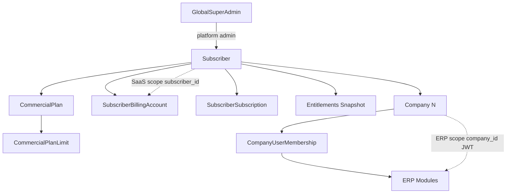

# ERP SaaS — Final Enterprise Architecture

**Status:** Official baseline as of 2026-05-20  
**Migration:** `20260520215307_InitialEnterpriseBaseline` (single source of truth; includes Wave 1 `company_id` + RLS)

---

## 1. Conceptual model



**Rule:** Subscriber pays and is governed. Companies operate. Billing never uses `company_id`.

---

## 2. Scopes

| Scope | Key | Examples |
|-------|-----|----------|
| **SaaS platform** | `subscriber_id` | Subscriptions, billing, limits, entitlements, companies registry |
| **ERP runtime** | `subscriber_id` today → **`company_id` target** | Sales, inventory, accounting (JWT already carries `company_id`; ERP row migration is Phase 6) |
| **Billing** | `subscriber_id` | `subscriber_billing_accounts`, `saas_billing_*`, `payment_provider_*` |
| **IAM** | `company_id` | `company_user_memberships` |

---

## 3. Official naming (domain + database)

### Core entities

| Domain type | Table |
|-------------|-------|
| `Subscriber` | `subscribers` |
| `Company` | `company` |
| `CompanyUserMembership` | `company_user_memberships` |
| `CommercialPlan` | `commercial_plans` |
| `CommercialPlanLimit` | `commercial_plan_limits` |
| `SubscriberSubscription` | `subscriber_subscriptions` |
| `SubscriberSubscriptionEvent` | `subscriber_subscription_events` |
| `SubscriberBillingAccount` | `subscriber_billing_accounts` |
| `SaasBillingInvoice` | `saas_billing_invoices` |
| `SaasBillingInvoiceLine` | `saas_billing_invoice_lines` |
| `BillingEvent` | `saas_billing_events` |
| `PaymentProviderCustomer` | `payment_provider_customers` |
| `PaymentProviderSubscription` | `payment_provider_subscriptions` |
| `PlatformFeature` | `platform_features` |
| `SubscriberCustomMenu` | `subscriber_custom_menus` |

### Retired naming (do not reintroduce)

- `Tenant`, `tenant_id`, `memberships`, `tenant_saas_*`
- `PK_tenants`, `FK_tenant_*`
- Index suffix `_tenant` → replaced by **`_subscriber`** in all explicit `HasDatabaseName` configurations

### ERP fiscal settings (not SaaS billing)

| Entity | Table | Note |
|--------|-------|------|
| `BillingSettings` | `billing_settings` | SRI / tirilla — **not** SaaS invoices |

---

## 4. Multi-company

- `Company.SubscriberId` → FK `fk_company_subscribers_subscriber_id`
- Index `ix_company_subscriber_id` (non-unique, 1:N)
- `Company`: `timezone`, `currency_code`, `logo_url`, `branding_json`
- `CompanyUserMembership`: **only** `company_id` + `identity_user_id` (unique)

---

## 5. Commercial governance

**Single enforcement:** `ICommercialPlanLimitService`

| Limit code | Purpose |
|------------|---------|
| `MAX_COMPANIES` | Holdings / franchises |
| `MAX_USERS` | Active memberships |
| `MAX_BRANCHES` | Branches per subscriber |
| `MAX_WAREHOUSES` | Warehouses per subscriber |
| `MAX_STORAGE_MB` | Reserved |
| `MAX_AI_TOKENS` | Reserved |
| `MAX_API_REQUESTS` | Reserved |

Seeds: `CommercialPlanLimitsBootstrap` (Starter → Enterprise).

---

## 6. SaaS billing (isolated)

- Provider adapter: `IPaymentProviderAdapter` (`NullPaymentProviderAdapter` default)
- Governance: `IBillingGovernanceService`, `BillingGateBehavior`
- API: `/api/saas/billing/account|invoices|events`
- Permission: `saas.billing.view`

No Stripe SDK in handlers. No overlap with `sales_invoice` / journal / SRI.

---

## 7. Entitlements cache

- `SubscriberEntitlementsSnapshot` + `IDistributedCache` (Redis-ready)
- Keys: `entitlements:version:{subscriberId}`, `entitlements:snapshot:{subscriberId}:v{N}`
- Invalidation on billing governance mutations

---

## 8. Security & RLS readiness

| Component | Role |
|-----------|------|
| JWT | `subscriber_id`, `company_id` |
| `ISessionContext` / `HttpSessionContext` | Request scope |
| `PostgreSqlSessionContextInterceptor` | `set_config('app.subscriber_id')`, `set_config('app.company_id')` |
| Global query filters | `ISubscriberScopedEntity` (excludes `Subscriber` root) |

RLS policies: **not enabled** — architecture prepared only.

---

## 9. EF Core migrations (definitive)

| Item | Value |
|------|-------|
| Baseline | `20260520215307_InitialEnterpriseBaseline` |
| Snapshot | `ErpDbContextModelSnapshot.cs` |
| Legacy chain | **Removed** (16+ incremental migrations) |
| Pending model check | Must be **false** after any entity change |

```bash
cd backend/src/ERP.Infrastructure
dotnet ef migrations has-pending-model-changes --startup-project ../ERP.API/ERP.API.csproj
dotnet ef database update --startup-project ../ERP.API/ERP.API.csproj
```

---

## 10. API & frontend alignment

### JWT / session (stable)

- Claims: `subscriber_id`, `company_id`
- `POST /api/auth/switch-company`
- `GET /api/companies`, `GET /api/companies/current`

### SaaS UI

- `/saas/companies`, `/saas/billing` (when enabled)
- `CompanySwitcher`, `select-company`

### Compatibility layer (intentional)

Some routes/logs still say `tenant` (e.g. `/api/admin/iam/tenant/*`, i18n `tenantSelect.*`). These are **API/UI aliases**, not domain types. Rename in a dedicated UX pass — not required for schema baseline.

Frontend types: `AuthResponse`, `SessionResponse` — `subscriberId`, `companyId`.

---

## 11. Validation checklist (2026-05-20)

| Check | Result |
|-------|--------|
| `dotnet build` | OK |
| `has-pending-model-changes` | false |
| `Database.MigrateAsync()` | OK |
| `ERP.API` startup | OK (`:5001`) |
| PostgreSQL `PK_subscribers` | OK |
| `company_user_memberships.company_id` | OK |
| SaaS billing tables | OK |
| Tests (limits/entitlements) | 8/8 |

---

## 12. Stabilization (post-baseline)

| Component | Status |
|-----------|--------|
| `CompanyScopeBehavior` | Active on ERP namespaces |
| `IEntitlementsCacheService` | Redis facade |
| `IPermissionsCacheService` | Redis-ready |
| RLS wave 1 | `products`, `warehouse`, `stock_movement`, `customers`, `sales_invoice` |
| Oleada 1 `company_id` | Product, Warehouse, StockMovement, CurrentStock |
| Rate limit | `per-subscriber` 600/min |
| Docs | `enterprise-smoke-tests.md`, `ARCHITECTURE.md`, `GOVERNANCE.md`, … |

## 13. Future roadmap

| Phase | Topic |
|-------|--------|
| 6 | ERP tables: dual-write → read `company_id` ([erp-company-id-migration-roadmap.md](./erp-company-id-migration-roadmap.md)) |
| 7 | Enable PostgreSQL RLS per scope |
| 8 | Stripe/Paddle via `IPaymentProviderAdapter` + webhooks |
| 9 | Frontend: rename remaining `tenant` i18n/routes to `subscriber` |

---

## 13. Related documents

- [phase-5-billing-foundation.md](./phase-5-billing-foundation.md)
- [phase-company-management.md](./phase-company-management.md)
- [migrations-repair-final-report.md](./migrations-repair-final-report.md)
- [Migrations README](../backend/src/ERP.Infrastructure/Migrations/README.md)
