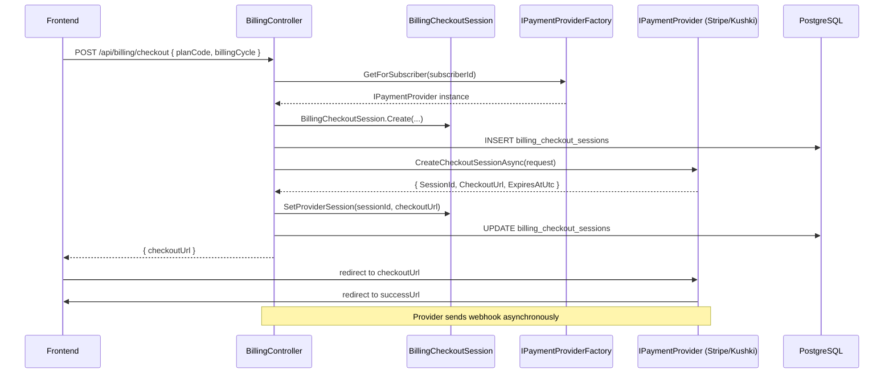
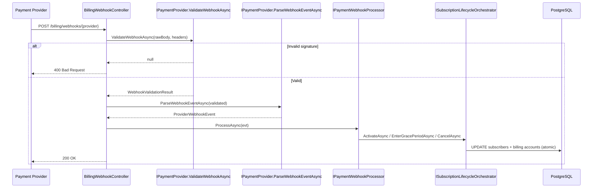
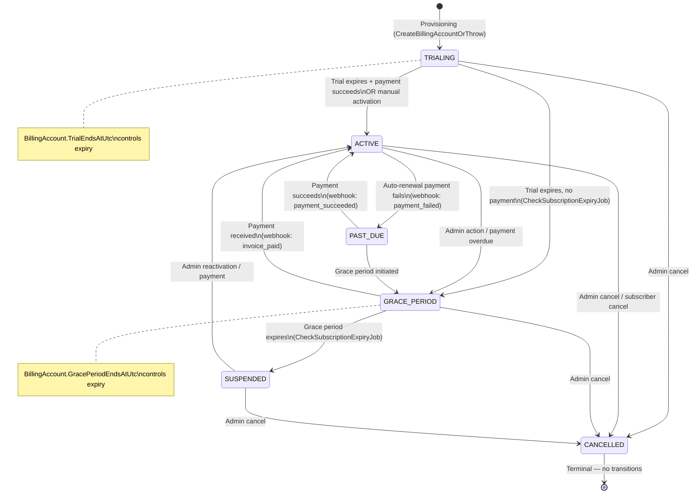
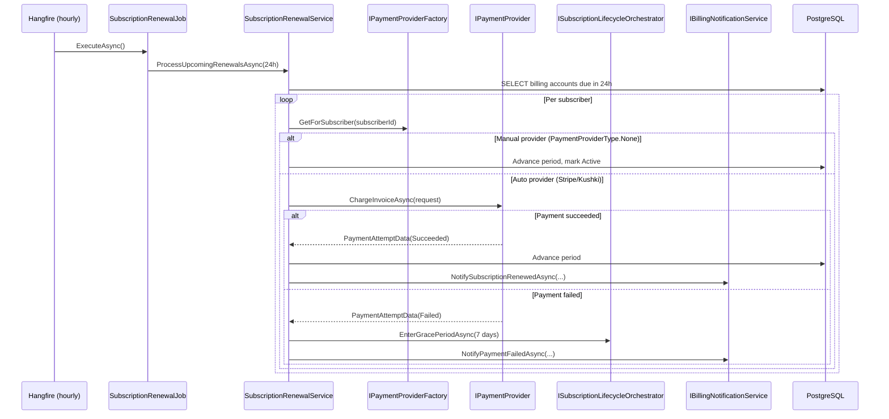
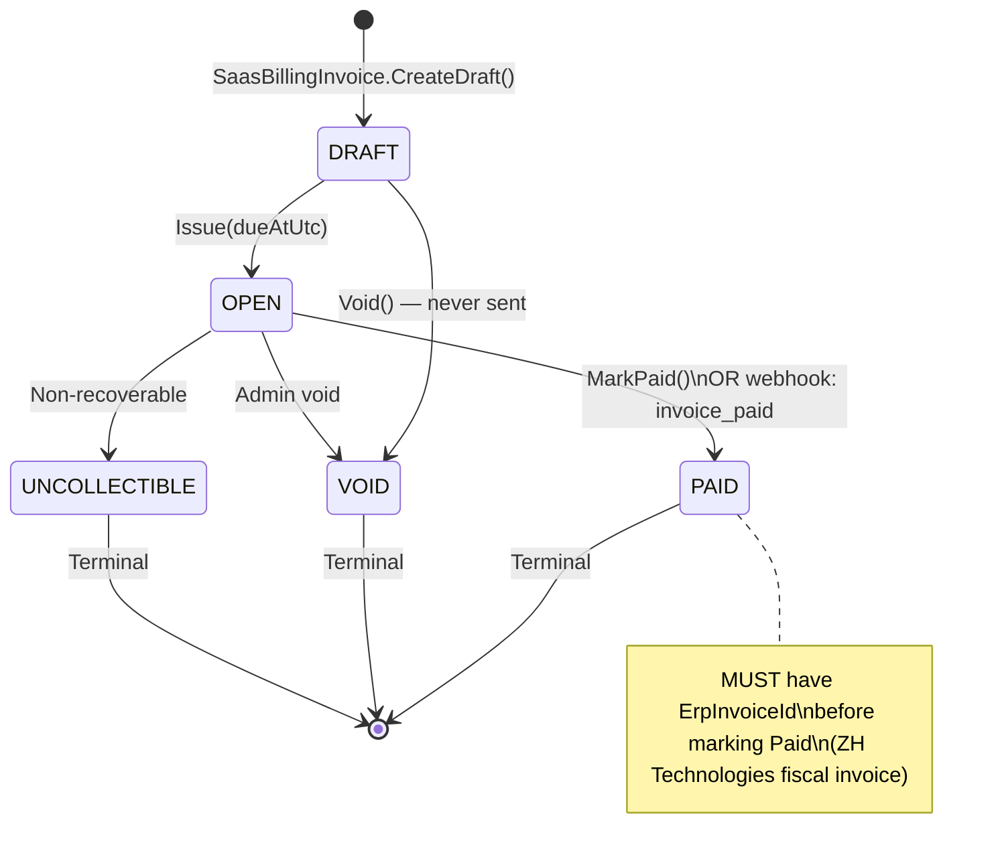
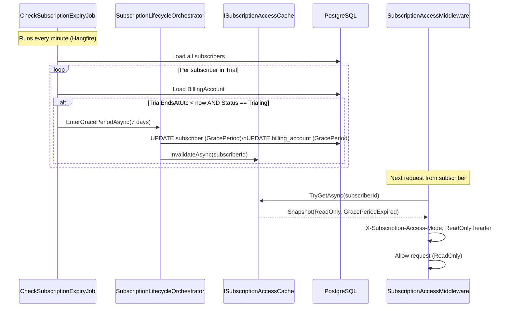
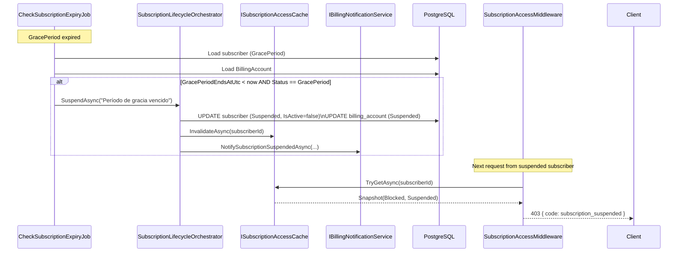
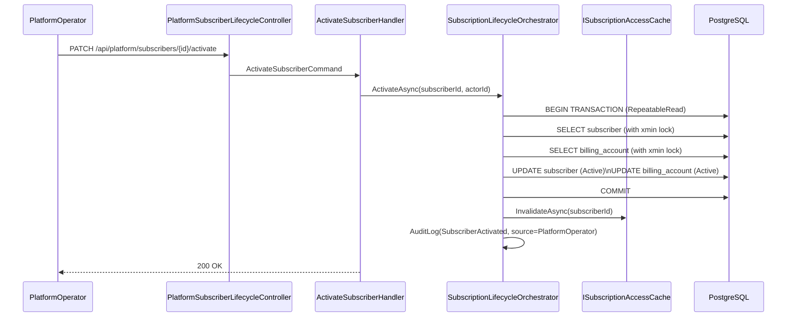

# Billing Architecture — ERP SaaS ZH Technologies

> ## 🚧 FUTURO / NO IMPLEMENTADO
>
> Este documento describe una posible plataforma externa futura.
>
> **NO forma parte del ERP actual.**
>
> No debe utilizarse como guía para desarrollar código dentro de ERP Core.

---

> **Estado:** Arquitectura lista. Payment providers NO conectados todavía.
> El sistema acepta cualquier provider futuro (Stripe, Kushki, PayPal, DataFast) sin cambios estructurales.

---

## 1. Flujo de Checkout (futuro — provider no conectado)



---

## 2. Flujo de Webhooks



---

## 3. Lifecycle de Suscripción (State Machine)



---

## 4. Flujo de Renovación Automática



---

## 5. Flujo de Invoice



---

## 6. Flujo de Grace Period



---

## 7. Flujo de Suspensión Automática



---

## 8. Flujo de Reactivación



---

## Ownership de Aggregates

| Aggregate | Source of Truth | Responsabilidad |
|---|---|---|
| `Subscriber` | Lifecycle (Active/Trial/GracePeriod/Suspended/Inactive) | Identidad SaaS, acceso a plataforma |
| `SubscriberBillingAccount` | Estado de cuenta (Trialing/Active/PastDue/GracePeriod/Suspended/Cancelled) | Fechas de trial/grace/período, estado de pago |
| `SubscriberSubscription` | Plan asignado (Active/Cancelled/etc.) | Entitlements de plan |
| `SaasBillingInvoice` | Invoice de cobro SaaS | Historial de cobros, link a factura ERP |
| `BillingPaymentAttempt` | Intentos de cobro | Reintentos, trazabilidad |
| `BillingCheckoutSession` | Sesión de checkout | URL de pago, expiración |
| `BillingEvent` | Audit inmutable | Log de todo evento de billing |

---

## Separación de Concerns

```
SubscriptionLifecycleOrchestrator
  → controla platform access (Active/Suspended/etc.)
  → NO conoce features ni quotas

ISubscriptionAccessService (cache-first)
  → evalúa gate de acceso (Blocked/ReadOnly/FullAccess)
  → NO modifica estado

IFeatureAccessService
  → evalúa features y quotas de plan
  → completamente independiente del lifecycle

IPaymentProvider (+ factory)
  → abstrae Stripe/Kushki/PayPal
  → NO conoce lifecycle ni features
```

---

## Providers Soportados (Futuro)

| Provider | Código | Estado |
|---|---|---|
| Manual (sin proveedor) | `none` | ✅ Activo (NullPaymentProvider) |
| Stripe | `stripe` | 🔜 Próxima fase |
| Kushki | `kushki` | 🔜 Próxima fase |
| PayPal | `paypal` | 🔜 Próxima fase |
| MercadoPago | `mercadopago` | 🔜 Futuro |
| DataFast | `datafast` | 🔜 Futuro |

Para agregar un nuevo provider:
1. Implementar `IPaymentProvider`
2. Registrar en `PaymentProviderFactory.GetByType()`
3. Configurar registro DI
4. NO cambiar ninguna otra clase

---

## Endpoints de Billing

| Endpoint | Estado | Descripción |
|---|---|---|
| `GET /api/billing/subscription` | ✅ Activo | Estado de cuenta + billing |
| `GET /api/billing/invoices` | ✅ Activo | Historial de facturas SaaS |
| `POST /api/billing/checkout` | 🔜 Stub 501 | Crear sesión de pago |
| `POST /api/billing/cancel` | 🔜 Stub 501 | Cancelar suscripción |
| `POST /api/billing/reactivate` | 🔜 Stub 501 | Reactivar suscripción |
| `POST /billing/webhooks/{provider}` | ✅ Pipeline listo | Recibir webhooks del provider |
