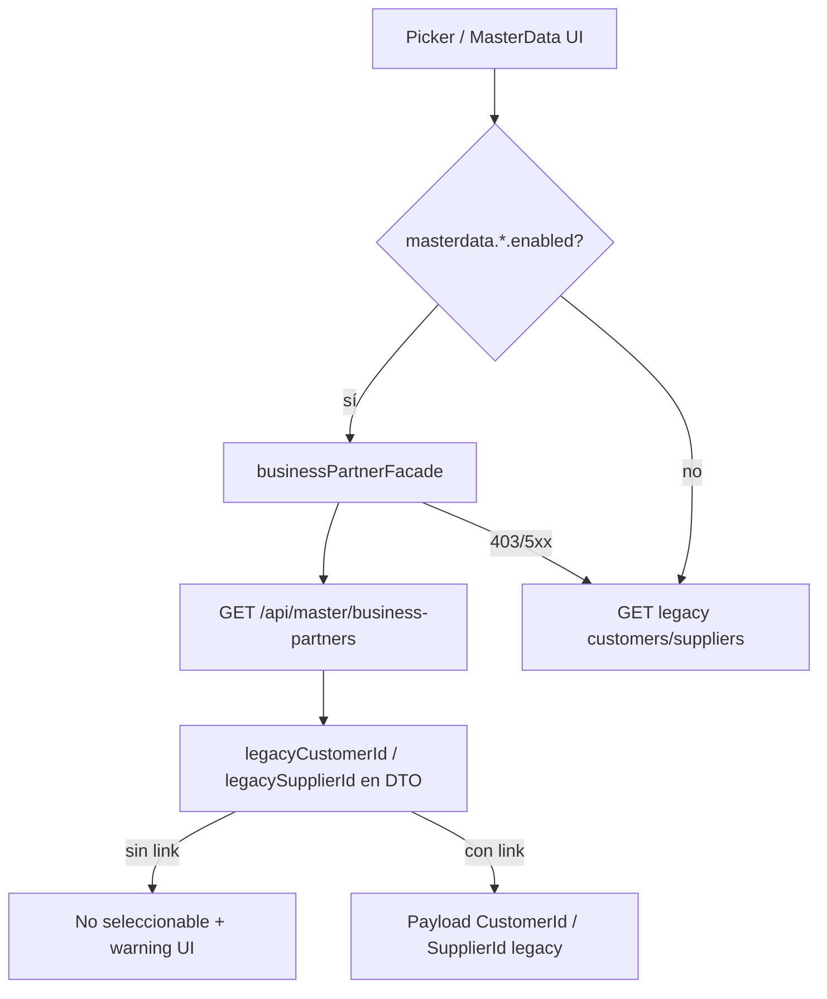

# Frontend MasterData — Migration Readiness

**Fecha:** 2026-05-23  
**Alcance:** coexistencia BusinessPartner (strangler) sin eliminar legacy.

## Migration readiness score

| Área | Score | Notas |
|------|-------|-------|
| Operational identity (pickers) | **85%** | API expone `legacyCustomerId` / `legacySupplierId`; backend aún resuelve por identificación en enricher |
| Pickers operacionales | **90%** | Factura/compra/gasto/OC — no seleccionable sin vínculo |
| Feature flags | **75%** | `masterdata.*.enabled` vía entitlements; requiere seed en planes |
| CRUD MasterData UI | **70%** | Páginas `/masterdata/customers|suppliers`; sin UPDATE BP en API |
| Observability | **80%** | `x-correlation-id`, `x-company-session-version`, logs DEV |
| Multiempresa hooks | **75%** | `useCompanyScopedAsync`; módulos críticos migrados, auditoría parcial |
| E2E enterprise | **65%** | Escenarios API; UI Playwright ampliados donde API disponible |
| Eliminación legacy | **0%** | Bloqueado hasta criterios finales |

**Global estimado: 72% — READY WITH WARNINGS**

---

## Módulos migrados (lectura / pickers)

| Módulo | MasterData | Legacy operacional |
|--------|------------|-------------------|
| Nueva factura venta | `businessPartnerFacade.searchCustomersForPicker` | `CustomerId` en POST factura |
| Nueva compra | `searchSuppliersForPicker` | `SupplierId` |
| Nuevo gasto | `searchSuppliersForPicker` | `supplierId` opcional |
| Nueva orden compra | `searchSupplierPickerOptions` | `proveedorId` |
| UI MasterData | `/masterdata/customers`, `/masterdata/suppliers` | — |

## Módulos legacy (sin cambios)

| Módulo | Servicio | Endpoint |
|--------|----------|----------|
| Clientes CRUD | `customerService` / `customerCatalogService` | `/api/sales/customers` |
| Proveedores CRUD | `supplierService` | `/api/purchases/suppliers` |
| Categorías/contactos clientes | `useCustomersPage` | legacy |

## Servicios — registro de deuda

| Servicio | Rol | Estado |
|----------|-----|--------|
| `businessPartnerService` | **Canónico** HTTP MasterData | Mantener |
| `businessPartnerFacade` | **Canónico** strangler + flags | Mantener |
| `operationalLinkResolver` | **Canónico** metadatos picker | Mantener |
| `customerService` (ventas) | **Legacy** operacional | Eliminar tras cutover |
| `customerCatalogService` | **Legacy** catálogo (mismo API) | Consolidar en facade lectura; CRUD sigue legacy |
| `supplierService` | **Legacy** operacional | Eliminar tras cutover |

## Dependencias restantes

1. **Backend:** tabla o FK explícita BP ↔ Customer/Supplier (hoy enricher por identificación/RUC).
2. **Entitlements:** activar `masterdata.customers.enabled` / `masterdata.suppliers.enabled` en planes SaaS.
3. **API:** GET company-settings por BP; UPDATE BusinessPartner (edición datos maestros).
4. **Frontend:** migrar `useCustomers` / reportes a `useCompanyScopedAsync`.
5. **React Query:** fuera de alcance actual.

## Blockers para cutover

- [ ] 100% facturas/compras con `legacy*Id` en DTO sin heurística de identificación
- [ ] Feature flags en todos los tenants productivos
- [ ] CRUD operacional en MasterData UI o redirección definitiva
- [ ] E2E verde con API `:5003` en CI
- [ ] Sin dual-write failures en métricas `masterdata.dualwrite_failed`

## Rollback plan

1. Quitar flags `masterdata.*.enabled` del plan (vuelve solo legacy en pickers).
2. Revertir imports de `businessPartnerFacade` en 4 pantallas operacionales.
3. Ocultar rutas `/masterdata/*` (no afectan legacy).
4. Backend: campos extra en DTO son compatibles hacia atrás.

## Criterios para eliminar legacy

1. Todos los pickers y CRUD usan `/api/master/business-partners` sin fallback.
2. Cero referencias a `customerService` / `supplierService` en `frontend/src` (grep CI).
3. Migración datos: cada BP activo con `legacyCustomerId`/`legacySupplierId` persistido en BD.
4. 2 releases sin incidentes multiempresa en pickers.
5. Documentación API y permisos actualizados; reglas B-xx en verde.

## Debt register

| ID | Prioridad | Descripción |
|----|-----------|-------------|
| MD-F-01 | P0 | Enricher backend aún empareja por identificación/RUC |
| MD-F-02 | P1 | Sin GET company-settings — formulario empresa sin valores previos |
| MD-F-03 | P1 | Sin UPDATE BP — edición solo create/disable/settings |
| MD-F-04 | P1 | Flags no sembrados en todos los planes |
| MD-F-05 | P2 | `customerCatalogService` vs `customerService` duplicados |
| MD-F-06 | P2 | Auditoría completa `useAsync` → `useCompanyScopedAsync` |

## Endpoints usados (frontend)

```
GET/POST   /api/master/business-partners
GET        /api/master/business-partners/{id}
DELETE     /api/master/business-partners/{id}
PATCH      /api/master/business-partners/{id}/company-settings
GET        /api/sales/customers          (legacy)
GET/POST   /api/purchases/suppliers      (legacy)
GET        /api/subscribers/entitlements/me (flags)
```

## Flujo coexistencia (actualizado)


