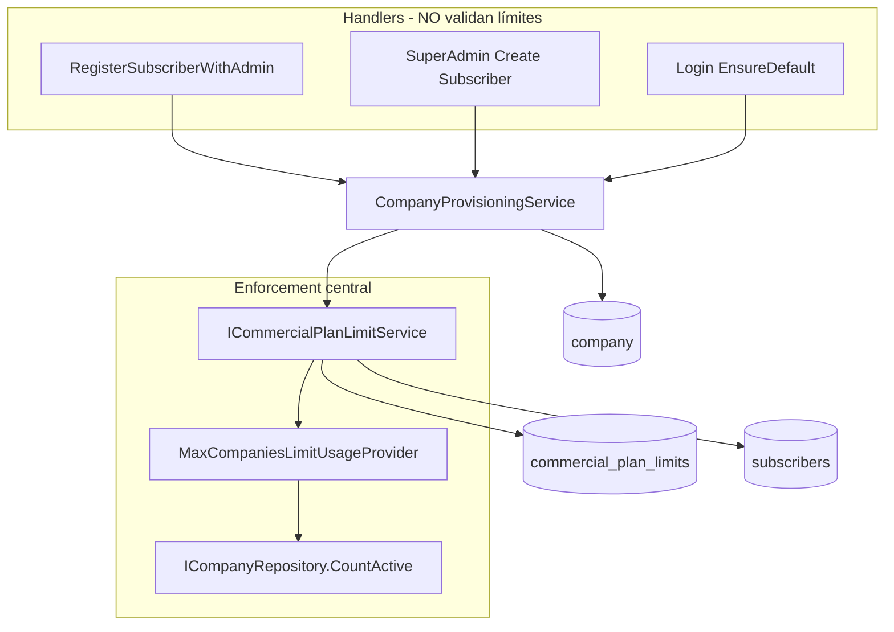
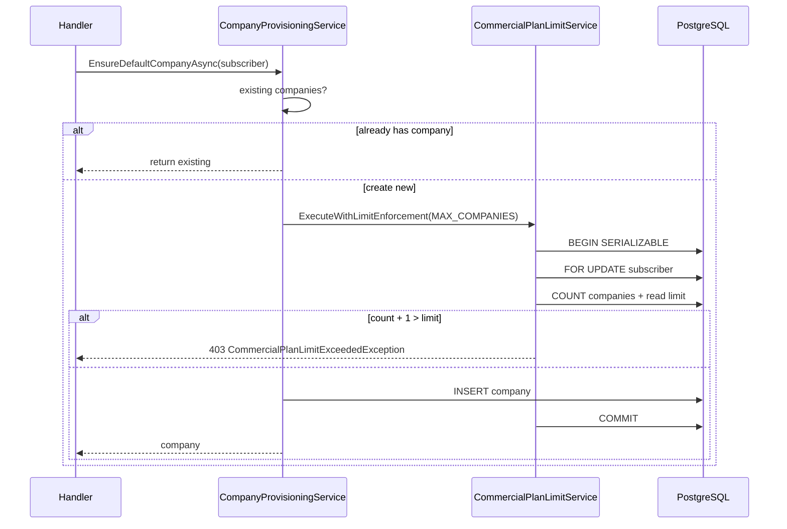

# Fase 4 — Commercial Plan Limits Enforcement

## 1. Impact analysis

| Área | Impacto |
|------|---------|
| **Domain** | `CommercialPlanLimitExceededException` (403) |
| **Application** | `ICommercialPlanLimitService`, snapshots, usage providers |
| **Infrastructure** | `CommercialPlanLimitService`, `MaxCompaniesLimitUsageProvider`, bootstrap seeds |
| **Provisioning** | Único punto de alta de `company`: `CompanyProvisioningService` |
| **Entitlements API** | `SubscriberEntitlementsSnapshot.CommercialLimits` |
| **Auth / JWT** | Sin cambios |
| **Frontend** | Mensaje API en errores de creación (ya lee `message`) |

## 2. Dependency map



## 3. Risk analysis

| Riesgo | Mitigación |
|--------|------------|
| Suscriptor sin fila en `commercial_plan_limits` | Sin fila → sin tope (allow) hasta seed; bootstrap idempotente en arranque |
| Registro antes de `SubscriberSubscription` | Resolución de plan por `subscribers.plan_code` |
| Bypass por `Companies.Add` directo | Solo `CompanyProvisioningService` persiste companies nuevas |
| Límite deployment vs plan | `DeploymentQuota` (instancia) y `CommercialPlanLimit` (SaaS) son capas distintas |

## 4. Concurrency analysis

- `ExecuteWithLimitEnforcementAsync`: transacción **Serializable** + `SELECT … FOR UPDATE` en `subscribers` (PostgreSQL).
- Re-evaluación de uso **dentro** de la transacción antes de `Add`.
- Dos `CreateCompany` concurrentes: una commit, la segunda ve `count >= limit` y recibe 403.

## 5. Security analysis

- Validación por `subscriber_id` del contexto de provisioning (no spoofing de otro tenant).
- Fail-closed si no hay plan activo al evaluar límite configurado.
- APIs internas no deben llamar `ICompanyRepository.AddAsync` sin pasar por `ICommercialPlanLimitService`.

## 6. Future limits roadmap

| limit_code | Usage provider (futuro) |
|------------|-------------------------|
| MAX_USERS | Count identity memberships |
| MAX_STORAGE_MB | Blob usage aggregator |
| MAX_PRODUCTS | Product catalog count |
| MAX_MONTHLY_INVOICES | Usage meter + period |
| MAX_API_REQUESTS | Edge counter |
| MAX_AI_TOKENS | AI usage table |
| MAX_BRANCHES | Branch repository |
| MAX_WAREHOUSES | Warehouse repository |

Patrón: implementar `ICommercialLimitUsageProvider` + fila en `commercial_plan_limits` — **sin** lógica hardcodeada en handlers.

## 7. Billing integration readiness

- `CommercialLimitsSnapshot.CacheKey` → Redis `commercial-limits:{subscriberId}`
- Overrides futuros: tabla `subscription_limit_overrides` (no implementada)
- `period_type` en `CommercialPlanLimit` listo para metering mensual/anual

## 8. Cache readiness

```csharp
CommercialLimitsSnapshot {
  CacheKey = "commercial-limits:{subscriberId}"
  ResolvedAtUtc
  LimitsByCode
}
```

`ISubscriberEntitlementsService.GetEntitlementsSnapshotAsync` ya incluye `CommercialLimits` para UI.

## 9. Technical debt found

| Item | Estado |
|------|--------|
| `SubscriberEntitlementsSnapshot.Limits` mezcla features medidas | Mantener; `CommercialLimits` separa plan limits |
| No existe API `POST /companies` operativa aún | Provisioning es el único gate |
| `SaasPlansAdminService` no edita `commercial_plan_limits` | Admin UI futura |
| Tests E2E concurrencia en PostgreSQL | Pendiente pipeline dedicado |

## 10. Enforcement flow



## Defaults (bootstrap)

| Plan | MAX_COMPANIES |
|------|---------------|
| starter | 1 |
| business | 3 |
| professional | 10 |
| enterprise | 0 (unlimited) |

`LimitValue <= 0` = sin tope numérico.
