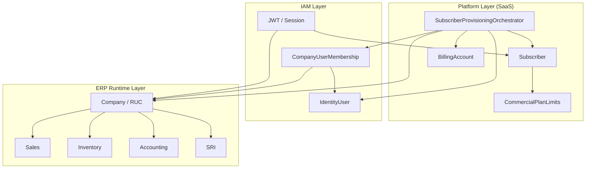
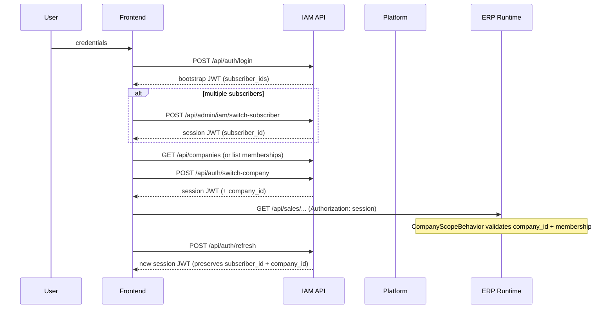
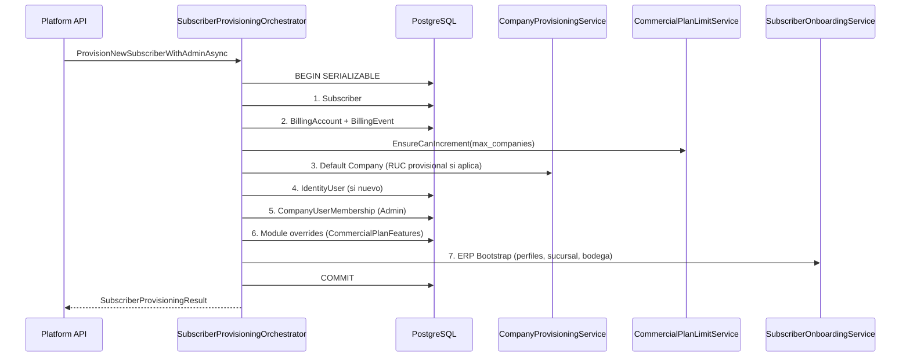

# Platform & Runtime Boundaries

Documento canónico de capas enterprise para el ERP SaaS. Define ownership, rutas API, JWT, provisioning, RLS y bounded contexts **sin** revertir la arquitectura `Subscriber → Companies → CompanyUserMembership`.

Relacionado: [enterprise-onboarding-fix.md](./enterprise-onboarding-fix.md), [legacy-tenant-cleanup.md](./legacy-tenant-cleanup.md).

---

## 1. Layers

| Layer | Scope key | Responsibility | API prefix (canonical) |
|-------|-----------|----------------|------------------------|
| **Platform** | `subscriber_id` (SaaS) | Onboarding, planes, límites comerciales, billing foundation, menús por plan/subscriber | `/api/platform/*` |
| **IAM** | `identity_user_id` | Auth **único** (`identity_users`), bootstrap, switch-subscriber/company, profiles, permissions | `/api/auth/*`, `/api/platform/auth/*`, `/api/admin/iam/*` (legacy alias) |
| **Billing** | `subscriber_id` | Cuentas de facturación SaaS, eventos, suscripción comercial | `/api/saas/billing/*` |
| **Subscriber** | `subscriber_id` | Configuración SaaS del cliente (settings, subscription, global params) | `/api/subscribers/{id}/*` |
| **Company** | `company_id` | Empresa fiscal (RUC), multi-company dentro del subscriber | `/api/companies/*`, Platform companies |
| **ERP Runtime** | `company_id` | Ventas, inventario, compras, contabilidad, caja, SRI | `/api/sales/*`, `/api/inventory/*`, … |



**Reglas de separación**

- Platform **no** ejecuta lógica operativa ERP (facturas, kardex, asientos).
- IAM **no** provisiona billing ni crea companies (delega a Platform orchestrator).
- ERP Runtime **siempre** filtra por `company_id`; nunca usa solo `subscriber_id` para datos fiscales.

---

## 2. Ownership matrix

| Concept | Owner layer | Key | Used for |
|---------|-------------|-----|----------|
| Suscriptor SaaS | Platform / Subscriber | `subscriber_id` | Plan, límites, billing, menú SaaS, module overrides |
| Empresa fiscal | Company / ERP Runtime | `company_id` | RUC, ventas, inventario, contabilidad, SRI |
| Usuario login | IAM | `identity_user_id` (JWT `sub`) | **Único store:** `identity_users` (Platform + Company). Tabla legacy `users` eliminada. |
| Membership | IAM | `(company_id, identity_user_id)` | Rol por empresa, permisos |
| Billing account | Billing | `subscriber_id` | Facturación SaaS, eventos |
| Commercial limits | Platform | `subscriber_id` | `CommercialPlanLimits` (max companies, users, …) |

| Operation | Required context |
|-----------|------------------|
| Crear subscriber | Platform (SuperAdmin) |
| Listar facturas | ERP Runtime + `company_id` |
| Cambiar plan | Subscriber / Platform |
| Invitar usuario a empresa | IAM + `subscriber_id` |
| Emitir FE SRI | ERP Runtime + `company_id` |

---

## 3. JWT claims

### Token types

| `token_type` | Purpose | Key claims |
|--------------|---------|------------|
| `bootstrap` | Post-login, antes de elegir subscriber | `subscriber_ids` (csv), `role: Bootstrap` |
| `session` | Operación normal | `subscriber_id`, optional `company_id`, `role` |

### Session claims (canonical)

| Claim | Type | Layer consumer |
|-------|------|----------------|
| `sub` | `Guid` | IAM — IdentityUser id |
| `email` | string | IAM |
| `subscriber_id` | `Guid` | Platform, Subscriber, Billing |
| `company_id` | `Guid` (optional until company selected) | Company, ERP Runtime |
| `company_role` | string (when `company_id` present) | IAM permissions |
| `role` | string | IAM authorization (`SuperAdmin`, `Admin`, …) |
| `token_type` | `bootstrap` \| `session` | IAM middleware |
| `full_name` | string | UI |

### Future scopes (reserved)

- `scopes`: fine-grained permissions (`sales:write`, `inventory:read`)
- `plan_code`: denormalized for edge caching (optional)
- `correlation_id`: request tracing (see §7)

**Implementación:** `AccessTokenService.GenerateSessionToken`, `JwtService.GenerateToken` (legacy user table).

---

## 4. Request lifecycle



### Steps

1. **Login** — `POST /api/auth/login` → bootstrap token.
2. **Select subscriber** — `POST /api/admin/iam/switch-subscriber` (alias frontend: `switchTenant`) → session with `subscriber_id`.
3. **Select company** — `POST /api/auth/switch-company` → session with `company_id` + `company_role`.
4. **Refresh token** — rotates access token; preserves subscriber/company context from refresh record.
5. **Switch company** — same as select company; re-issues JWT; ERP queries use new `company_id`.

SuperAdmin global bypass: `subscriber_id == Guid.Empty` + role `SuperAdmin` → `CompanyScopeBehavior` platform bypass.

---

## 5. Provisioning lifecycle

Orquestador: `ISubscriberProvisioningOrchestrator` / `SubscriberProvisioningOrchestrator`.

Transacción **Serializable** — fallo en cualquier paso → rollback total.



| Step | Service | Responsibility |
|------|---------|----------------|
| 1 | Orchestrator | `Subscriber.Create`, operational settings |
| 2 | Orchestrator | `SubscriberBillingAccount`, audit event |
| 3 | `CompanyProvisioningService` | Default company, provisional RUC `TMP-EC-*` |
| 4 | Orchestrator | `IdentityUser` + password hash |
| 5 | Orchestrator | `CompanyUserMembership` Admin |
| 6 | `SubscriptionFeatureOverridesService` | Plan module overrides |
| 7 | `SubscriberOnboardingService` | ERP seed: profiles, branch, warehouse |

**Entry points**

- Canonical: `POST /api/platform/subscribers`
- Legacy: `POST /api/admin/iam/superadmin/subscribers` (`[Obsolete]`)

---

## 6. RLS strategy

PostgreSQL session variables (applied by `DbSessionContextApplicator`):

```sql
SET LOCAL app.subscriber_id = '<guid>';
SET LOCAL app.company_id = '<guid>';
```

Policies (baseline migrations) pattern:

```sql
subscriber_id::text = NULLIF(current_setting('app.subscriber_id', true), '')
OR company_id::text = NULLIF(current_setting('app.company_id', true), '')
```

| Variable | Set when | Purpose |
|----------|----------|---------|
| `app.subscriber_id` | Session has subscriber | SaaS-scoped rows, config |
| `app.company_id` | Session has company | ERP operational isolation |

**Source of truth for HTTP:** `ISessionContext` ← JWT claims via `CurrentSubscriberService` / `CurrentCompanyService`.

**Background jobs:** `JobCompanyContext` (AsyncLocal) supplies `ICurrentCompany` when no HttpContext.

RLS is **ready** in schema; activation is incremental per table/wave migrations.

---

## 7. Bounded contexts

| Context | Namespace (logical) | Physical folder (current) | API |
|---------|---------------------|---------------------------|-----|
| Platform | `ERP.Application.Platform.*` | `Modules/Platform`, `Modules/Tenants`, provisioning | `/api/platform/*` |
| Billing | Platform.Billing | `Domain/Billing`, `/api/saas/billing` | `/api/saas/billing/*` |
| IAM | `ERP.Application.IAM.*` | `Modules/Access`, `Modules/Auth` | `/api/auth/*`, `/api/admin/iam/*` |
| Inventory | ERPRuntime | `Modules/Inventory` | `/api/inventory/*` |
| Sales | ERPRuntime | `Modules/Sales`, `Sales/*` | `/api/sales/*` |
| Accounting | ERPRuntime | `Modules/Accounting` | `/api/accounting/*` |
| Reporting | ERPRuntime | reports / analytics per company | TBD |
| SRI | ERPRuntime | electronic invoicing handlers | `/api/sales/*` (SRI) |

Marker types (logical boundaries, no file moves):

- `ERP.Application.Platform.PlatformLayerBoundary`
- `ERP.Application.IAM.IamLayerBoundary`
- `ERP.Application.ERPRuntime.ErpRuntimeLayerBoundary`

---

## 8. Context interfaces

### `ICurrentSubscriber`

- Reads JWT claim `subscriber_id`.
- Use: SaaS config, plan limits, subscriber-scoped admin.
- **Do not** use for sales/inventory/accounting queries.

### `ICurrentCompany`

- Reads JWT claim `company_id`; falls back to `JobCompanyContext` in background jobs.
- Use: all ERP operational handlers.
- `HasCompanyContext` false → `CompanyScopeBehavior` blocks ERP commands.

### `ISessionContext`

- Unified view for RLS interceptor: `SubscriberId`, `CompanyId`, `IsPlatformAdmin`.
- Drives `DbSessionContextApplicator` SET LOCAL.

### `JobCompanyContext`

- Static AsyncLocal for Hangfire/background processors.
- Must be set before ERP repository calls in jobs.

### `CompanyScopeBehavior`

- MediatR pipeline: validates active subscriber + company membership + billing.
- Namespace prefixes for auto-scoping: Sales, Inventory, Purchasing, Accounting, Cash, Products.
- Bypass: SuperAdmin without subscriber context.

---

## 9. API route map

### Platform (canonical)

| Method | Route | Description |
|--------|-------|-------------|
| GET | `/api/platform/subscribers` | List subscribers (MediatR) |
| POST | `/api/platform/subscribers` | Create subscriber + admin |
| GET | `/api/platform/subscribers/{id}/menu` | Resolved menu |
| PUT | `/api/platform/subscribers/{id}/menu` | Custom menu |
| DELETE | `/api/platform/subscribers/{id}/menu` | Reset menu |

### Legacy aliases (temporary, `[Obsolete]`)

| Legacy route | Canonical replacement |
|--------------|----------------------|
| `GET /api/admin/iam/superadmin/subscribers` | `GET /api/platform/subscribers` |
| `POST /api/admin/iam/superadmin/subscribers` | `POST /api/platform/subscribers` |
| `GET/PUT/DELETE /api/admin/iam/superadmin/subscribers/{id}/menu` | `/api/platform/subscribers/{id}/menu` |
| `GET /api/superadmin/subscribers` | `GET /api/platform/subscribers` (legacy includes user metrics) |

Frontend continues calling legacy URLs until migrated; both remain functional.

### IAM

| Route | Purpose |
|-------|---------|
| `POST /api/auth/login` | Login |
| `POST /api/admin/iam/bootstrap-login` | Bootstrap login (identity) |
| `POST /api/admin/iam/switch-subscriber` | Select subscriber |
| `POST /api/auth/switch-company` | Select company |
| `POST /api/auth/refresh` | Refresh session |

### ERP Runtime (examples)

| Prefix | Module |
|--------|--------|
| `/api/sales/*` | Sales + SRI |
| `/api/inventory/*` | Inventory |
| `/api/purchases/*` | Purchasing |
| `/api/accounting/*` | Accounting |

---

## 10. Observability foundation (contracts only)

Not fully implemented — reserved contracts for next phase.

### Correlation

| Header / claim | Purpose |
|----------------|---------|
| `X-Correlation-Id` | End-to-end request id (generate if missing) |
| Log scope `CorrelationId` | Structured logging enrichment |

### Context enrichment (every log entry)

```json
{
  "correlation_id": "uuid",
  "subscriber_id": "guid-or-empty",
  "company_id": "guid-or-empty",
  "identity_user_id": "guid",
  "route": "POST /api/platform/subscribers"
}
```

### Audit strategy

| Event type | Layer | Storage |
|------------|-------|---------|
| `subscriber.create` | Platform | `user_activity` |
| `billing.*` | Billing | `billing_events` |
| `auth.login` | IAM | auth audit (TBD) |
| ERP mutations | ERP Runtime | entity audit tables |

### Tracing phases (planned)

1. Middleware: accept/propagate `X-Correlation-Id`
2. `ISessionContext` → Serilog enricher
3. OpenTelemetry spans with subscriber/company tags
4. Audit bus for cross-layer events

---

## 11. Migration checklist (API consumers)

1. ~~Point new integrations to `/api/platform/subscribers`.~~ **Frontend migrado** (`superAdminService`, `companyService`).
2. Legacy routes remain on backend for external integrations until deprecation window ends.
3. Do not introduce new `/api/admin/iam/superadmin/*` consumers.
4. ERP modules: always send session JWT with `company_id` after company selection.
