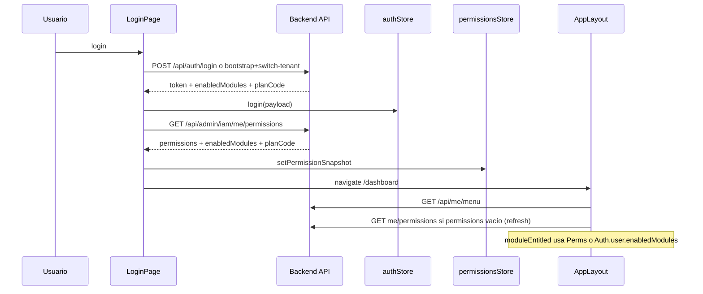

# SaaS Enterprise Refactor — Iteración 00: Inventario y mapa de verdad

**Branch:** `refactor/saas-enterprise-00-inventory`  
**Fecha:** 2026-05-20  
**Alcance:** Solo `docs/` (iteración 00). Sin cambios en `.cs` de runtime.  
**Baseline git:** `main` @ `f550a78` (post Fase A + Fase B; inventario re-baseline + extensión FRONT+BACK).

**Contrato:** Modo Ultra Estricto del prompt de refactor (adoptado tal cual; no rediseñado). Una iteración → una rama → un entregable acotado → fail-closed por defecto.

**Extensión de alcance (FRONT+BACK):** reglas F1–F3 — el frontend no debe duplicar gating; debe consumir un **entitlements snapshot** único del backend. Esta iteración 00 **solo documenta** gaps; la implementación es iteración posterior acotada.

---

## Resumen ejecutivo (estado actual en `main`)

El core SaaS opera con **una fuente de verdad relacional** para entitlements comerciales:

| Capa | Autoridad efectiva |
|------|-------------------|
| Módulos / features de plan | `ITenantEntitlementsService` → `TenantEntitlementsService` (suscripción activa + `SaasPlanFeature` + overrides) |
| JWT / sesión / DTOs | `ISessionModulesResolver` → entitlements (fail-closed sin suscripción) |
| HTTP `perm:*` | `PermissionHandler` → `ITenantEntitlementsService.AllowsPermissionAsync` |
| MediatR `[RequireFeature]` | `SubscriptionGateBehavior` → `ISubscriptionService` / entitlements |
| Overrides SuperAdmin | `ITenantSubscriptionOverridesService` → `tenant_subscription_feature_overrides` |
| Sync plan | `Tenant.PlanCode` → `ErpDbContext.SyncTenantSubscriptionsFromPlanCodeAsync` (no destructivo + eventos) |
| Consultas sin filtro tenant | `IPlatformQueryAccessor.Unfiltered` (único `.IgnoreQueryFilters()` en `PlatformQueryAccessor`) |

**Eliminado en Fase B-10:** `Tenant.EnabledModulesJson`, columna `enabled_modules`, `GetEffectiveEnabledModules`, `PreferLegacyEnabledModulesJsonForSession`.

**Drift residual backend:** `AllModuleKeys` (español) vs `CanonicalModuleKeys` (inglés); claim JWT `enabledModules`; sin API de lectura de `tenant_saas_subscription_events`.

**Drift residual frontend (bloqueante E2E):** varias fuentes de módulos en cliente; catálogo hardcodeado `TENANT_MODULE_KEYS`; `navConfig` fallback con `moduleKey` español; rutas sin guard por módulo; **no existe** `GET /api/saas/entitlements/me`.

---

## Tabla: quién decide qué (post Fase A+B)

| Decisión | Fuente actual | Consumidores principales |
|----------|---------------|-------------------------|
| Módulos habilitados (JWT/UI) | `ITenantEntitlementsService` vía `ISessionModulesResolver` | Login, RefreshToken, Register, SwitchTenant, GetMyPermissions, SuperAdmin, `TenantDto` |
| Permiso HTTP por plan | `ITenantEntitlementsService.AllowsPermissionAsync` | `PermissionHandler` |
| Feature MediatR | `ISubscriptionService.HasFeatureAsync` (delega entitlements) | `SubscriptionGateBehavior`, ~60 commands `[RequireFeature]` |
| Límites medidos | `TenantSubscriptionUsage` + UPSERT atómico | `SubscriptionGateBehavior` |
| Plan comercial | `Tenant.PlanCode` + `TenantSaasSubscription` (sync + eventos) | Handlers tenant, menú, analytics |
| Menú navegación | `TenantCustomMenu` / `SaasPlan.MenuConfigJson` / `navConfig` fallback | `TenantMenuService`, `AppLayout` |
| RBAC perfil | `AccessProfilePermission` | `PermissionHandler`, `GetMyPermissionsHandler` |

---

## Modelo de datos

| Concepto | Entidad / artefacto |
|----------|---------------------|
| Plan comercial | `SaasPlan` |
| Features del plan | `SaasPlanFeature` + `SaasFeatureDefinition` |
| Suscripción activa | `TenantSaasSubscription` |
| Overrides | `TenantSubscriptionFeatureOverride` |
| Usage | `TenantSubscriptionUsage` |
| Auditoría plan/overrides | `TenantSaasSubscriptionEvent` |
| Catálogo validación entrada | `TenantSubscriptionCatalog` (estático; `CanonicalModuleKeys`, mapping permisos) |

---

## Referencias por símbolo (runtime — `main`)

### `ITenantEntitlementsService` / `ISessionModulesResolver`

| Archivo | Uso |
|---------|-----|
| `backend/src/ERP.Application/Subscriptions/ITenantEntitlementsService.cs` | Contrato SoT |
| `backend/src/ERP.Infrastructure/Services/TenantEntitlementsService.cs` | Implementación |
| `backend/src/ERP.Application/Subscriptions/SessionModulesResolver.cs` | Módulos sesión |
| `backend/src/ERP.API/Authorization/PermissionHandler.cs` | Gating HTTP |
| Handlers auth + `GetMyPermissionsHandler` | DTO / JWT `enabledModules` |

### `TenantSubscriptionCatalog`

| Archivo | Uso |
|---------|-----|
| `backend/src/ERP.Application/Common/TenantSubscriptionCatalog.cs` | `CanonicalModuleKeys`, `ResolveEnabledModulesAsync`, `TenantAllowsPermissionAsync`, `ValidateModuleKeysOrThrow`, `AllModuleKeys` (solo SuperAdmin sin tenant) |
| `backend/src/ERP.Application.Tests/TenantSubscriptionCatalogTests.cs` | Contrato fail-closed + mapping |

### `IPlatformQueryAccessor`

| Archivo | Uso |
|---------|-----|
| `backend/src/ERP.Infrastructure/Persistence/PlatformQueryAccessor.cs` | Único `.IgnoreQueryFilters()` |
| `ErpDbContext`, seeders, `TenantEntitlementsService`, repos vía `.Unfiltered(...)` | Cross-tenant controlado |
| `backend/src/ERP.Infrastructure.Tests/Persistence/IgnoreQueryFiltersAuditTests.cs` | Allowlist única |

### `Tenant.PlanCode` + sync + eventos

| Archivo | Uso |
|---------|-----|
| `backend/src/ERP.Domain/Modules/Tenants/Entities/Tenant.cs` | `PlanCode`, `SetPlanCode` |
| `backend/src/ERP.Infrastructure/Persistence/ErpDbContext.cs` | Sync + `TenantSaasSubscriptionEvents` |
| `backend/src/ERP.Infrastructure/Services/TenantSubscriptionOverridesService.cs` | Overrides + eventos módulo |

### Frontend (fail-closed UI — Fase B-07)

| Archivo | Comportamiento |
|---------|----------------|
| `frontend/src/components/AppLayout.tsx` | `mods.length === 0` → **oculta** módulos (`return false`) |
| `frontend/src/pages/SuperAdminPanelPage.tsx` | `hasModuleRestrictions` desde API |
| `frontend/src/nav/navConfig.ts` | Fallback con `moduleKey` español en algunos ítems |

---

## Extensión FRONT+BACK — auditoría frontend (`frontend/`)

### Reglas de contrato (F1–F3)

| Regla | Estado actual | Objetivo |
|-------|---------------|----------|
| **F1** No duplicar gating en FE | **Incumple** — `moduleEntitled` en `AppLayout`, catálogo `TENANT_MODULE_KEYS`, alias ES en `subscriptionModules.ts` | FE solo interpreta snapshot del API |
| **F2** Catálogo server-driven | **Incumple** — `TENANT_MODULE_KEYS`, `buildNavGroups` estático, chips SuperAdmin locales | Módulos/features/límites solo desde backend |
| **F3** Cambio = API + FE + test mínimo | **Pendiente** — sin endpoint snapshot ni test e2e de entitlements | Playwright o unit al introducir snapshot |

### Dónde el front decide menú / rutas / permisos

| Decisión UI | Archivo(s) | Fuente de datos hoy | ¿Alineado con backend SoT? |
|-------------|------------|---------------------|----------------------------|
| **Menú lateral (grupos/ítems)** | `AppLayout.tsx`, `nav/navConfig.ts` | Primario: `GET /api/me/menu` (`accessService.getSessionMenu`). Si vacío/error: grupos derivados de menú API sin fallback estático completo en runtime normal. Transformación: `mapSessionMenuToNavGroups`. | **Parcial** — ítems de menú en BD traen `moduleKey`/`permissionKey`; filtro adicional en cliente |
| **Filtro por módulo contratado** | `AppLayout.tsx` → `moduleEntitled(key)` | `enabledModules` desde **Zustand** (`permissionsStore`) con fallback a `user.enabledModules` del **JWT** (`authStore`) | **Doble fuente** — puede desincronizar JWT vs `getMyPermissions` |
| **Filtro por permiso RBAC** | `AppLayout.tsx`, `PermissionGuard.tsx`, páginas `*Page.tsx` | `permissions` desde `GET /api/admin/iam/me/permissions` (perfil filtrado por plan en backend) | **Alineado** para permisos; módulos siguen en el mismo DTO, no snapshot dedicado |
| **Rutas React** | `routes/mainRoutes.tsx`, `ProtectedRoute.tsx` | Solo **autenticación** + rol SuperAdmin global; **no** guard por `enabledModules` ni feature | **Gap** — deep link a pantalla sin módulo → UI puede ocultar menú pero ruta sigue montada |
| **SuperAdmin: chips / formulario módulos** | `SuperAdminPanelPage.tsx`, `CompanyModuleChips.tsx`, `constants/subscriptionModules.ts` | Catálogo **hardcodeado** `TENANT_MODULE_KEYS` (9 claves EN + alias ES). Escritura: `enabledModules` en create/update tenant vía API SuperAdmin | **F2** — catálogo no viene del servidor |
| **Flags operativos (no comercial)** | `FeatureGate.tsx`, `useFeatureFlag` | `ConfigService` / KV tenant (`ui.*`) | Capa distinta; no confundir con `SaasPlanFeature` |

### Mapping permission → module en frontend

| Mecanismo | Ubicación | Comportamiento |
|-----------|-----------|----------------|
| **Normalización permiso** | `permissionsStore.normalizePolicyPermissionKey` | Quita prefijo `perm:`; compara strings con lista del perfil |
| **Permiso en menú** | `SessionMenuItemDto.permissionKey` / `permissionKeysAny` desde API menú | Filtrado en `AppLayout.itemVisible` vía `hasPerm` |
| **Permiso en nav estático** | `navConfig.ts` ítems (`inventory.products.view`, etc.) | Solo si menú cae en fallback estático (poco usado en sesión con menú BD) |
| **Módulo en menú** | `NavGroup.moduleKey` / `NavItem.moduleKey` | `moduleEntitled` compara con `enabledModules` (case-insensitive), **sin** tabla central permission→module en FE |
| **Alias módulo ES→EN** | `subscriptionModules.ts` → `LEGACY_MODULE_KEY_ALIASES` | Solo para chips SuperAdmin y `moduleKeysMatch`; **no** usado en `moduleEntitled` del menú principal |

**Riesgo:** menú BD/plan puede usar `moduleKey: "sales"` (inglés) mientras `navConfig` fallback usa `ventas` / `inventario` → con módulos API en inglés, fallback ocultaría grupos enteros si se activara.

### Dónde se leen módulos (store / config / auth)

| Almacén | Archivo | Campos | Origen |
|---------|---------|--------|--------|
| **Zustand persist** | `store/permissionsStore.ts` | `enabledModules`, `permissions`, `planCode` | `setPermissionSnapshot` tras login/switch/refresh |
| **Zustand persist** | `store/authStore.ts` | `user.enabledModules`, `user.planCode`, token | Respuesta `POST /api/auth/login`, `switch-tenant`, sesión bootstrap |
| **Constantes** | `constants/subscriptionModules.ts` | `TENANT_MODULE_KEYS` | Hardcode (espejo de `CanonicalModuleKeys` backend) |
| **Menú API** | `types/access.ts` → `SessionMenuGroupDto.moduleKey` | Por ítem/grupo en BD | Backend `TenantMenuService` |
| **i18n** | `i18n/locales/*.json` | Etiquetas módulos | Presentación; no gating |

### Flujo: login, cambio de tenant, refresh permisos



| Evento | Limpia stores | Refetch permisos | Refetch menú |
|--------|---------------|------------------|--------------|
| Login exitoso | `clearPermissions` + `login` | `getMyPermissions` | `AppLayout` effect por `user.tenantId` |
| Switch tenant (`TenantSelectPage`) | `clearPermissions` | `getMyPermissions` + `session.enabledModules` en auth | Mismo effect menú |
| Refresh página | Rehidratación persist | Si `permissions.length === 0` → `getMyPermissions` | `getSessionMenu` |
| Logout | `clearPermissions` + logout | — | — |

**Gap F1:** `enabledModules` puede venir del JWT en auth y del endpoint IAM; no hay un único **entitlements snapshot** versionado.

### Backend: endpoint existente vs objetivo

| Endpoint actual | Devuelve | Usado por FE para gating |
|-----------------|----------|-------------------------|
| `GET /api/admin/iam/me/permissions` | `permissions[]`, `planCode`, `enabledModules` | Sí — store permisos + módulos |
| `GET /api/me/menu` | Grupos menú con `moduleKey`, `permissionKey` | Sí — estructura menú (no lista plana de entitlements) |
| Login / switch-tenant body | `enabledModules`, `planCode` en JWT payload | Sí — fallback en `moduleEntitled` |
| **`GET /api/saas/entitlements/me`** | **No existe** | — |

**Handler actual:** `GetMyPermissionsHandler` — módulos vía `ISessionModulesResolver` (SoT); permisos de perfil filtrados con `TenantAllowsPermissionAsync`. **No expone** `enabledFeatures[]` ni `limits{}`.

### Entregable objetivo (iteración futura — fuera de 00)

**API propuesta:** `GET /api/saas/entitlements/me` (autenticado, tenant del contexto)

```json
{
  "planCode": "starter",
  "planName": "Starter",
  "enabledModules": ["access", "sales", "inventory"],
  "enabledFeatures": ["SALES", "INVENTORY"],
  "limits": { "CUSTOMERS": 100 },
  "hasModuleRestrictions": true
}
```

**Frontend (misma iteración que API):**

1. `entitlementsService.getMe()` — única lectura post-login / post-switch-tenant.
2. Reemplazar uso dual JWT + `getMyPermissions` para **módulos** (permisos RBAC pueden seguir en IAM o incluirse en snapshot si se unifica).
3. `AppLayout.moduleEntitled` → lee solo snapshot (sin `TENANT_MODULE_KEYS` para gating).
4. Test: Playwright smoke ampliado o unit de mapper (menú oculto si `enabledModules` vacío).

---

## Riesgos / drift abiertos (post refactor)

| # | Tema | Estado | Iteración objetivo |
|---|------|--------|-------------------|
| R1 | `AllModuleKeys` (ES) vs `CanonicalModuleKeys` (EN) en SuperAdmin global | Abierto | Post-B / doc |
| R2 | `navConfig.ts` `moduleKey: 'ventas'` vs API `sales` | Abierto | FRONT-BACK iter |
| R3 | Sin API/UI para `tenant_saas_subscription_events` | Abierto | Post-B |
| R8 | **FE: doble fuente `enabledModules`** (JWT + permissions) | Abierto | FRONT-BACK iter |
| R9 | **FE: catálogo `TENANT_MODULE_KEYS` hardcodeado** (F2) | Abierto | FRONT-BACK iter |
| R10 | **FE: rutas sin guard por módulo** (deep link) | Abierto | FRONT-BACK iter |
| R11 | **No existe entitlements snapshot API** (F1/F3) | Abierto | FRONT-BACK iter |
| R4 | Claim JWT `enabledModules` (tamaño token) | Abierto | Post-B opcional |
| R5 | `Tenant.PlanCode` denormalizado | Abierto | Post-B opcional |
| R6 | ADRs/inventario histórico desactualizado | Abierto | Doc |
| R7 | `ERP.Application.Tests` no compila (tipos ajenos al refactor) | Abierto | Deuda repo |

---

## Orden de ejecución (contrato — no ampliar scope)

| Iteración | Rama | ID | Entregable | Estado en `main` |
|-----------|------|-----|------------|------------------|
| **00** | `refactor/saas-enterprise-00-inventory` | Inventario | Este documento | **En curso (re-baseline)** |
| 01 | `refactor/saas-enterprise-01-entitlements-service` | A1 | `ITenantEntitlementsService` | Implementado |
| 02 | `refactor/saas-enterprise-02-safe-defaults` | A2 | Fail-closed módulos | Implementado |
| 03 | `refactor/saas-enterprise-03-unified-gates` | A3 | Gates HTTP + MediatR | Implementado |
| 04 | `refactor/saas-enterprise-04-usage-upsert` | A4 | Usage UPSERT | Implementado |
| 05 | `refactor/saas-enterprise-05-platform-query` | A5 | `IPlatformQueryAccessor` + audit | Implementado |
| 06 | `refactor/saas-enterprise-06-phase-a-closeout` | Cierre A | Docs + flags | Implementado |
| 07 | `refactor/saas-enterprise-07-fail-closed-ui` | B7 | Frontend fail-closed | Implementado |
| 08 | `refactor/saas-enterprise-08-stop-legacy-json` | B8 | Overrides relacionales | Implementado |
| 09 | `refactor/saas-enterprise-09-platform-query-migration` | B9 | Migración IQF | Implementado |
| 10 | `refactor/saas-enterprise-10-legacy-cleanup` | B10 | Drop JSON + eventos | Implementado |
| **11** | `refactor/saas-enterprise-11-entitlements-snapshot-e2e` | FRONT+BACK | `GET /api/saas/entitlements/me` + consumo FE + test | **Implementado** |

**Nota operativa:** `main` ya contiene 01–10. Iteración **11** es el primer entregable de la extensión FRONT+BACK (F1–F3). Iteraciones 01–10: verificación + gap mínimo sin reimplementar.

---

## Open Questions

Registradas aquí; no bloquean continuar con fail-closed.

1. **¿Re-ejecutar 01–10 como ramas nuevas o solo auditoría?** `main` ya mergeó el refactor completo. Default: auditoría por iteración sin duplicar código.
2. **¿`moduleKey` oficial en UI/menú: inglés canónico (`sales`) o español alias (`ventas`)?** Hoy API entrega inglés; `navConfig` mezcla español.
3. **¿Deprecar `Tenant.PlanCode` y leer plan solo desde `TenantSaasSubscription`?** Hoy columna + sync en `SaveChanges`.
4. **¿Eliminar claim `enabledModules` del JWT en etapa separada?** Sigue poblado desde entitlements.
5. **¿Exponer `tenant_saas_subscription_events` en SuperAdmin?** Tabla y escritura existen; sin endpoint.
6. **¿Unificar `AllModuleKeys` → `CanonicalModuleKeys` para sesión SuperAdmin global?** Hoy `AllModuleKeys` solo en login/switch SuperAdmin sin tenant.
7. **¿Actualizar ADR-0001…0006 e inventario pre-refactor como histórico o reescribir?** Evitar confusión con estado actual.
8. **¿`GET /api/saas/entitlements/me` reemplaza por completo a `GET /api/admin/iam/me/permissions` para módulos, o conviven?** Fail-closed: un solo snapshot evita drift.
9. **¿Permisos RBAC del perfil van dentro del snapshot o endpoint separado?** Hoy mezclados en `MyPermissionsDto`.
10. **¿Rutas React deben tener guard por módulo o basta con menú oculto + 403 API?** Deep links y bookmarks.
11. **¿Catálogo SuperAdmin (`TENANT_MODULE_KEYS`) se carga desde API de definiciones SaaS?** Hoy hardcode en `subscriptionModules.ts`.
12. **¿Menú 100% server-driven eliminando `buildNavGroups` fallback?** Impacto si `GET /api/me/menu` vacío.

---

## Verificación iteración 00

- [x] Solo archivos bajo `docs/refactor/` modificados en esta iteración.
- [x] Sin cambios en `.cs` / `.tsx` de aplicación.
- [x] Open Questions registradas arriba.
- [ ] Rama `refactor/saas-enterprise-00-inventory` commit + listo para iteración 01.

Referencias de cierre: [phase-a-closeout](./saas-enterprise-phase-a-closeout.md), [phase-b-closeout](./saas-enterprise-phase-b-closeout.md).
